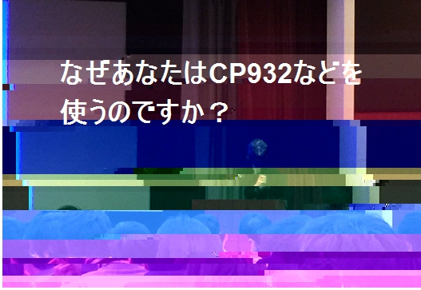

Mukiau(向き合う) - Face Against the Dark
============================

This package helps you to raise a war cry before throwing yourself into the harsh battle against some darkness, or "つらみ"in Japanese.

### Installation

```r
devtools::install_github("yutannihilation/mukiau")
```

### Usage

```r
library(mukiau)
mukiau("なぜあなたはCP932などを使うのですか？")
```


